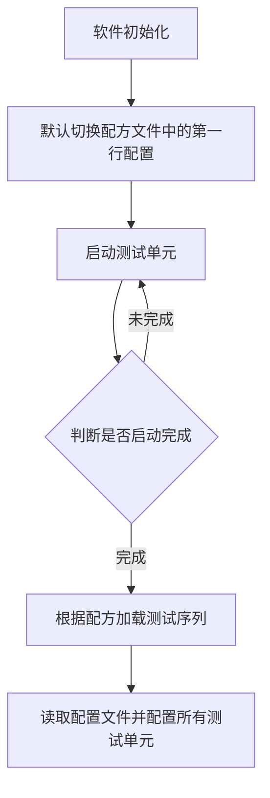
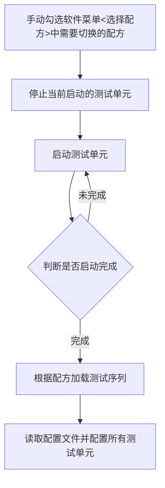
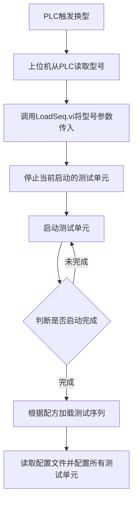
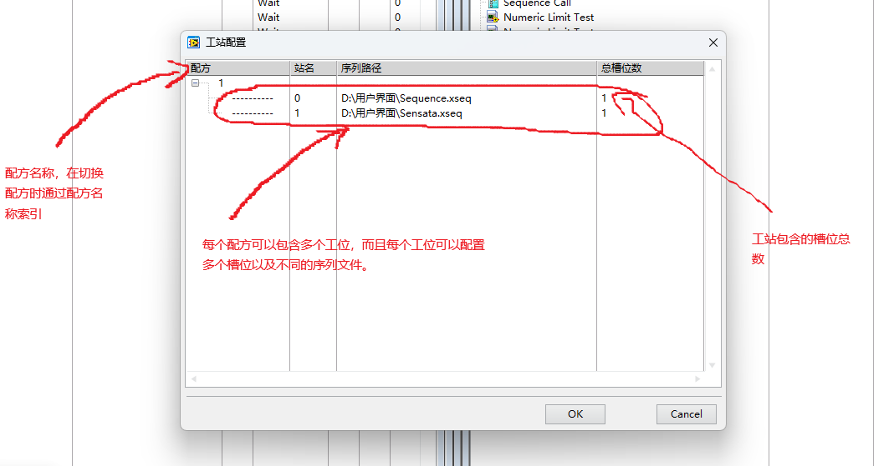

# Full User Interface

## 软件介绍

LabVIEW开发的通用测试设备上位机软件，支持多工位测试，支持多线程同步。

## 软件架构

基于[TestBenchFramework](https://gitee.com/xiongxinwei/test-bench-framework)开发的功能测试上位机软件，软件模块使用[DQMH](https://wiki.dqmh.org/dqmh/downloads)开发。

## 如何下载

[下载地址](https://gitee.com/xiongxinwei/full-user-interface/releases)

## 安装教程

1. [下载](https://gitee.com/xiongxinwei/full-user-interface/releases)仓库到本地

2. 安装"Full User Interface (DQMH).vipc"

3. 下载安装"[TestBenchFramework](https://gitee.com/xiongxinwei/test-bench-framework)"工具包

## 程序启动流程介绍

## 程序换型流程介绍

- 通过软件菜单换型

- 通过PLC信号换型

## 软件使用说明

- **用户登陆**
  默认用户为"**Administrator**"，默认密码为**<mark>空</mark>**，用户可以在”测试序列编辑器“中编辑用户信息。

- **测试单元配置**
  测试单元配置是用来配置测试引擎的文件，配置文件主要有三个部分“本地报表”“数据库”“执行设置”。
  程序启动的时候和换型完成后以及测试单元配置文件修改后都会重新配置所有已经启动的测试单元。

- **数据库**
  软件使用MySQL，需要安装数据库服务端和ODBC驱动，**<mark>请注意由于数据库表格中使用了JSON字符串所以数据库版本必须是*8.0*以上版本</mark>**。
  如果需要启动数据库功能需要在“测试单元配置”中启动数据库并且设置好数据库链接方式。

- **软件运行日志**
  为了方便调试和排查问题，软件中增加了一些状态记录，并且将程序运行记录保存在"/App/Log"文件夹中

- **工站配置**
  工站配置是用来保存被测产品与序列对应关系的文件，在换型的时候需要调用此配置文件。
  目前换型的方式有两种一种是通过软件菜单手动选择型号，另外一种是在程序里通过调用换型的API来自动换型，例如PLC换型或者扫码换型。

## 软件开发说明

- 用户开发的所有程序必须放在“External interactions”文件夹中。

- 用户只需要在“External interactions.vi”中修改程序，主要是PLC交互程序和MES交互程序。

- 如果需要**<mark>更新升级</mark>**上位机软件只需要将新版本的“Full User Interface”和“Test Unit”模块文件夹替换到项目中即可。

