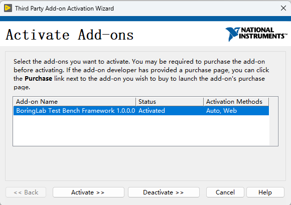
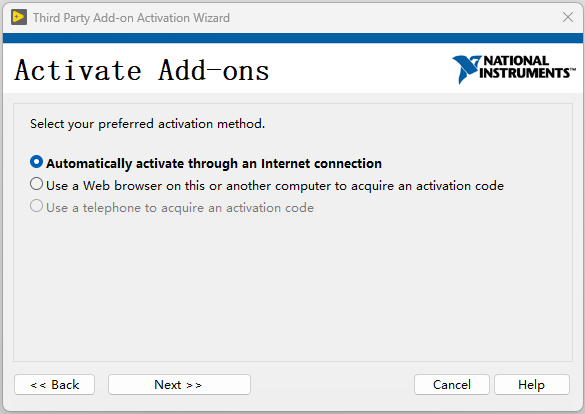
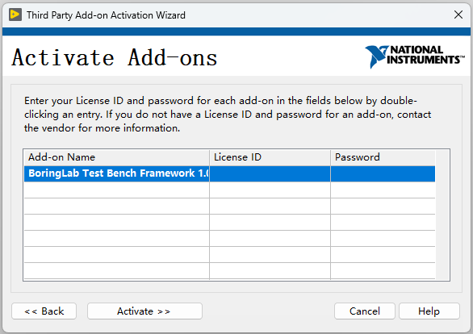

# 安装方法

## 安装环境

操作系统：Windows系统 

LabVIEW：**LabVIEW2019 SP1 f5** 以及以上版本 **32位**

VIPM：2019版本

> **提示：** 安装Labview会自动安装对应版本的VIPM。
> **注意：** 使用其他设备的GOST系统可能会导致软件异常，需要将LabVIEW卸载后重装。

## 安装包下载

安装包下载[地址](https://gitee.com/xiongxinwei/test-bench-framework/releases)

> **提示：** 下载发布页面中最新版本的vip文件。

## 安装过程

1. 关闭所有运行的软件包括LabVIEW

2. 以**管理员权限**启动VIPM(安装LabVIEW时记得勾选安装JKI VIPM)

3. 通过VIPM菜单栏“File”→“Open Package File(s)”选择下载好的安装包

4. 安装过程中弹出的选项窗口选择“Yes”选项

> **提示：** 一定要以管理员身份启动VIPM和LabVIEW否则在安装过程中会出现报错。

## 如何激活

安装完成后启动LabVIEW，在菜单栏中选择“帮助”-->“激活第三方附加软件..”

在弹出的对话框中选择“Test Bench Framework”，点击激活按钮继续。

选择通过网络自动激活选项，点击继续按钮。

输入授权码和密码，点击激活按钮。

> **License ID:** 3381301 **Password:** 4228JXQB

> **注意：** 激活过程需要联网。
