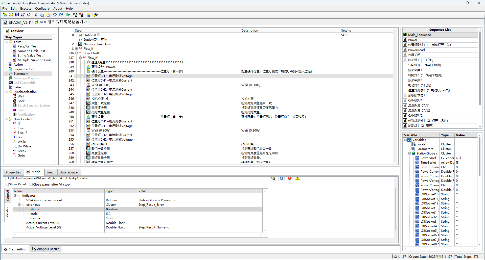

# 快速入门

## 如何启动测试序列编辑器

软件安装完成后会自动在桌面创建测试序列编辑器的快捷方式，测试序列编辑器默认路径“<mark>C:\Test Bench\Sequence Edit\Sequence Editor.exe</mark>”。也可以通过LabVIEW菜单“Tool”-->"Test Bench Framework"-->"Sequence Editor"选项启动测试序列编辑器。测试序列编辑器启动后会新建一个序列编辑页面，并且弹出登陆对话框，默认用户为管理员，默认密码为空，直接点击确定即可登陆。

## 如何创建一个可供TB框架调用的VI库

1. 创建一个LabVIEW工程文件。

2. 在工程文件浏览中添加一个LV库文件。

3. 在库文件中添加需要被调用的VI文件。
   
   > **注意：** 要将需要设置和读取数据的控件连接到接线端，否则在步骤属性中刷新不了控件。

4. 选中库文件右键菜单“Test Bench Framework”-->"Reentrcy VI Maker"，这个选项可以将库中的VI都设置为可重入。
   
   > **注意：** 如果库中有全局变量VI则会报错，建议将全局变量，FGV移除库之后在使用这个工具将库中的VI设置为可重入。

5. 在工程文件浏览器中新建一个打包库文件，选中LV工程文件浏览器最下面的“Build Specifications”右键菜单“New”-->>"Packed Library"，在弹出的窗口中设置好输出的目标路径以及“Source Files”选项卡中将需要打包的库移动到“Top-level Library”列表中，然后选择“Build”生成LV打包库（PPL）文件。

## 如何编辑测试序列

1. 新建一份测试序列，在测试序列编辑菜单中选择“File”-->"New"打开一个新的测试序列编辑页面。

2. 添加测试步骤，选择编辑界面左边步骤类型栏中的“Numeric Limit Test”步骤类型，拖拽到右边的步骤列表中。

3. 设置步骤属性，在步骤列表中选择已经添加好的步骤，在最下方的属性面板中选择“Model”选项卡，点击浏览按钮在弹出的文件浏览器中选择需要调用的PPL文件，然后在PPL文件浏览器中选择需要调用的VI文件。如果VI的状态是可以执行的那么在下面的控件设置面板中会刷新出来控件列表，选择需要设置值的输入控件然后双击"Value"栏给控件赋值或者使用界面右侧的变量列表中的变量给输入控件赋值。

4. 设置测试步骤的结果变量，在第3步设置好输入（Control）控件后需要切换到输出（Indicator）控件的页面，将界面右侧变量列表中的"Step"-->"Result"-->"Numeric"变量拖拽到需要判断结果的输出控件的“Value”栏。

5. 保存序列文件，选择测试序列编辑器的菜单“File”-->"Save"选项保存已经编辑好的测试序列文件。

## 如何执行（调试）测试序列

1. 打开已经编辑好的测试序列文件。

2. 选择测试序列编辑器菜单“Execute”-->"Run UUT"，如果不需要执行完整的序列文件，可以选择需要执行的步骤右键菜单选择“Run Select Steps”。

3. 在启动的执行界面中点击“Run”按钮启动测试。

4. 测试结果会保存到配置文件中指定的文件夹。

## 使用上位机软件调用测试序列

1. 下载[Full User Interface](https://gitee.com/xiongxinwei/full-user-interface)最新的发行版源代码。

2. <mark>仔细阅读“README”文档中的内容</mark>，依据文档部署好开发环境。

3. 打开“Full User Interface(DQMH).lvproj”工程文件，检查运行环境，运行“Launcher.vi”。

4. 选择菜单“用户”-->"登陆"，上位机的用户管理系统和测试序列编辑器共用。

5. 选择菜单“配置”-->“工站”配置好工站调用的测试序列路径和槽位数。

6. 通过菜单“选择配方”选择配置好的配方文件。

7. 选择菜单“外部交互”-->"打开前面板"，点击启动测试按钮。

8. 根据“README”文档中的内容对上位机软件进行开发。

