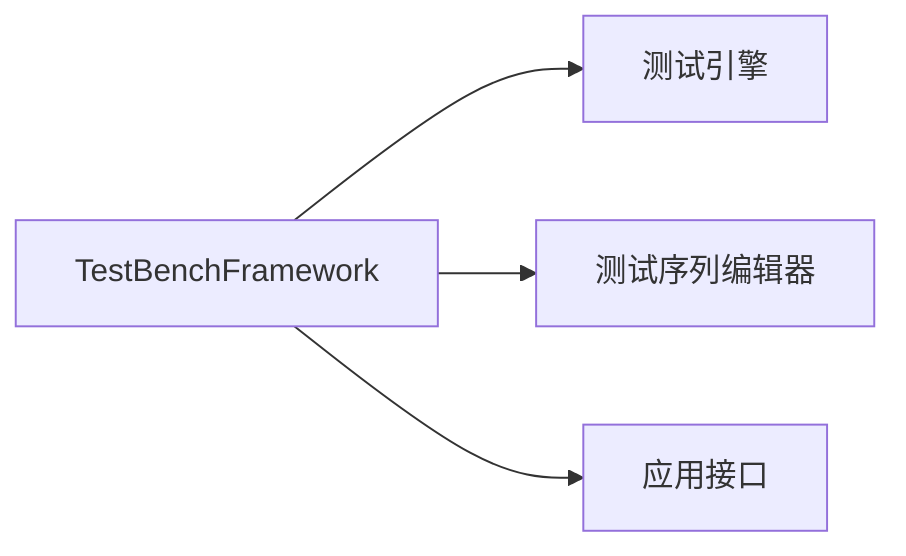
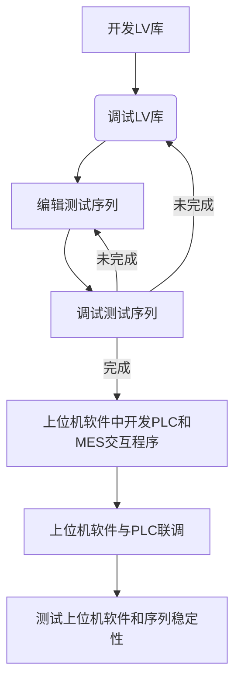

# 框架概览

## 框架结构

## 功能定义

- 测试序列编辑器
  
  - 编辑测试序列文件
  
  - 调试测试序列

- 测试引擎
  
  - 执行测试序列
  
  - 生成报表
  
  - 数据查询
  
  - 数据交互

- 测试引擎应用接口（API）
  
  - 在上位机软件中嵌入测试引擎

## 工作流程

> **提示：** 如果用户不使用“FullUserInterface“上位机程序进行二次开发，则需要使用框架的应用接口开发上位机软件。
