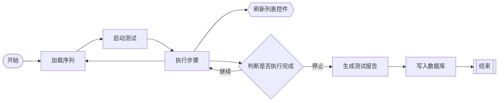
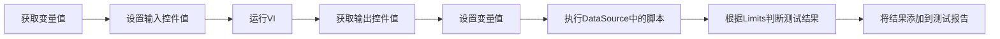

#### 简介

测试引擎是用来执行测试序列的核心程序。测试引擎控制序列执行的流程，生成本地报表，管理运行的线程，以及数据交互。

#### 如何使用测试引擎

在上位机软件中调用测试引擎的接口（API）

#### 调用序列流程

```mermaid
flowchart LR
S([开始])-->A[加载序列]
A-->B[启动测试]
B-->C[执行步骤]
C-->A
C-->F{{刷新列表控件}}
C-->D{判断是否执行完成}
D-->|继续|C
D-->|停止|E[生成测试报告]
E-->G[写入数据库]
G-->H[[结束]]
```

#### 调用VI流程

```mermaid
flowchart LR
A[获取变量值]-->B[设置输入控件值]
B-->C[运行VI]
C-->D[获取输出控件值]
D-->E[设置变量值]
E-->F[执行DataSource中的脚本]
F-->G[根据Limits判断测试结果]
G-->H[将结果添加到测试报告]
```

